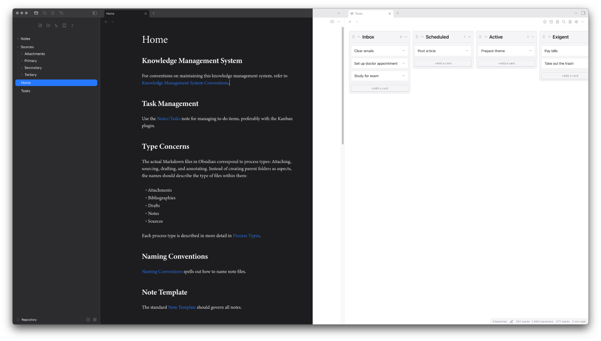

# Auger

Auger is a minimalist theme for Obsidian that prioritizes long-form writing and readability. It provides a clean, elegant, and unobtrusive interface, allowing you to focus on your notes.

## Features

*   **Pristine Typography:** Auger is designed for a superior reading experience. It features generous line spacing, a clear and legible font stack, font smoothing and antialiasing, and a well-balanced type scale.
*   **Minimalist Aesthetic:** The theme is intentionally spare, removing visual noise so you can concentrate on your writing.
*   **Sleek Sidebar:** The sidebar has been redesigned to be both beautiful and functional. It's easy to navigate your vault without being distracting.
*   **Light and Dark Modes:** Auger includes light and dark modes to suit your environment and preference.
*   **Kanban Plugin Support:** The theme includes custom styling for the Kanban plugin, ensuring a consistent experience.
* **Style Settings Plugin Support**: When the Style Settings plugin is enabled, additional customizations are available:
    * *Custom Colors for Bold and Italic Text*
    * *Light Canvas in Dark Mode*
    * *Font Smoothing Toggle*
    * *Custom Inline Title Font*
    * *Custom Inline Title Size, Weight, and Line Height*
    * *Inactive Window Blur*

---

  Auger is licensed under the <a href="https://creativecommons.org/licenses/by/4.0/">Creative Commons Attribution 4.0 International license</a>.

